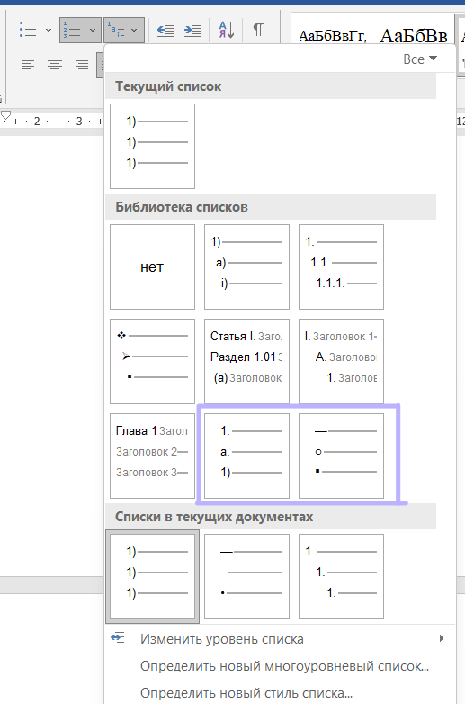
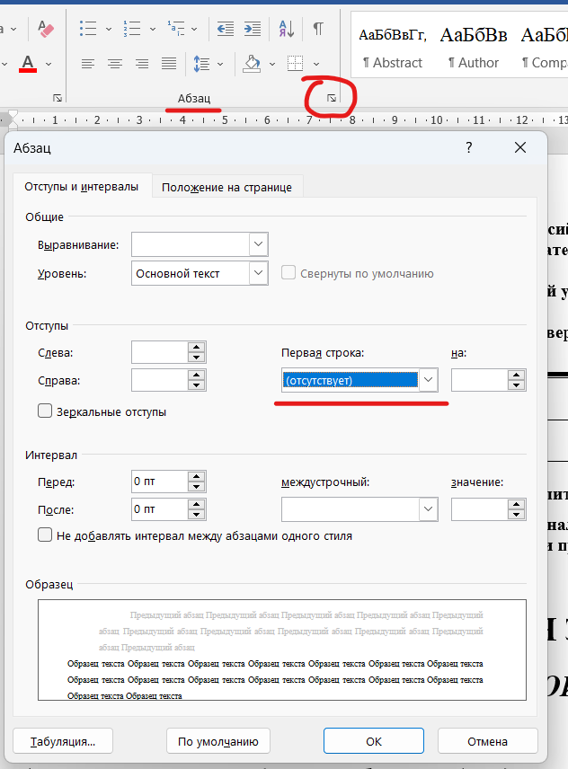

# Шаблоны ГОСТ для Pandoc

В репозитории собраны файлы-шаблоны, позволяющие получить документы в формате `.docx` с помощью `pandoc`, оформление которых будет соответствовать (или почти соответствовать) ГОСТам на оформление работ, в т.ч. НИРов.

## Описания файлов

- `gost-reference.docx` - файл-шаблон для `pandoc`. При его использовании будет создан файл, оформленный близко к требованиям ГОСТ.
- `gost-reference.dotx` - файл-шаблон для `Microsoft Word`. Файл настроен так же, как и `.docx`, однако используется в Word для создания новых документов на его основе. Используйте его, если хотите создавать документы через Word и иметь готовые стили для оформления в соответствии с ГОСТ. Файл необходимо поместить в директорию с настраиваемыми шаблонами, к примеру `C:\Users\[username]\Documents\Настраиваемые шаблоны Office`.
- `gost-r-7-0-5-2008-numeric.csl` - файл стиля оформления источников, взятый из [репозитория стилей CSL](https://editor.citationstyles.org/about/). Стиль оформляет список литературы в порядке упоминания источников и в формате, близким к ГОСТ.
- `gost-r-7-0-5-2008-numeric.csl` - файл стиля оформления источников, созданный на основе `gost-r-7-0-5-2008-numeric.csl`. В нём изменён вид ссылок на электронные источники для большего соответствия стандартам.

## Использование с Pandoc

Для того чтобы получить документ в формате `.docx` с оформлением по ГОСТу, необходимо воспользоваться командой:

```bash
pandoc -i [INPUT_FILE] -o [OUTPUT_NAME].docx --reference-doc="gost-reference.docx"
```

Для добавления **списка источников**, необходимо:

1. Добавить в команду опцию `--citeproc`
2. Указать на файл с источниками и файл стиля оформления источников. Сделать это можно в файле-источнике, добавив секцию метаданных со следующими элементами:
```
---
bibliography: sources.bib
csl: gost-r-7-0-5-2008-custom.csl
---
```

`Pandoc` может добавить **оглавление** в начало документа. Для этого добавьте в команду опцию `--toc`.

## Рекомендации

Для заголовков разделов и частей следует использовать заголовки первого уровня: они будут размещены в центре страницы, написаны заглавными буквами, без нумерации. 

Рисунки и подписи к ним автоматически центрируются. Подпись к рисунку следует размещать в ссылке на рисунок, например:

```markdown

```

Подпись к таблице возможно организовать с помощью ключевого слова `Table:`, размещённого в тексте файла перед таблицей. Например:

```markdown
Table: Таблица 1 - Пример таблицы
|1|2|
|-|-|
|3|4|
```

## Ограничения и недостатки

1. При генерации Word документа `pandoc` не разбивает таблицы, как того требует ГОСТ.
2. Нумерованные и ненумерованные списки по умолчанию не соответствуют ГОСТ. В настоящий момент рекомендуется вручную выставить для списков один из выделенных многоуровневых списков, которые оформлены близко к ГОСТ.

3. У оглавления используется заголовок "Table of Contents". В данный момент требуется вручную его переделывать. У списка источников заголовка нет вообще, необходимо добавлять вручную.
4. При подстановке титульных листов МГТУ текст на них может разъехаться. Для восстановления прежнего вида следует выделить весь текст и убрать отступ первой строки.

5. Разрывы страниц пока требуется создавать вручную.